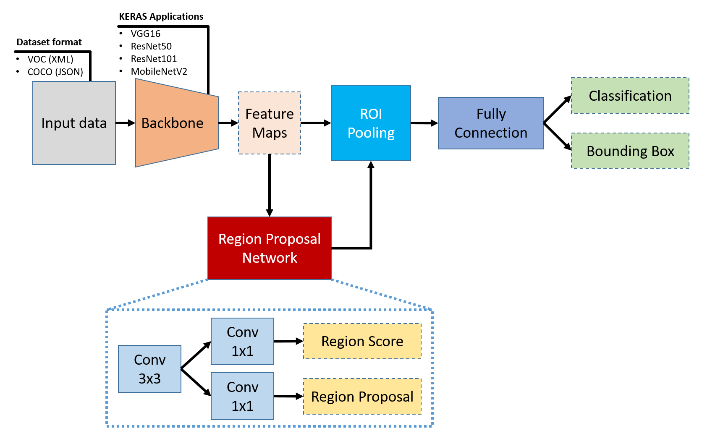
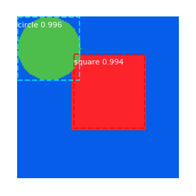
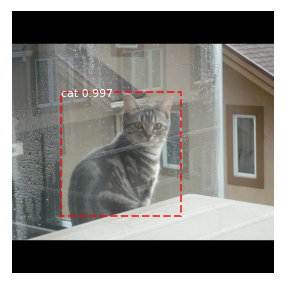
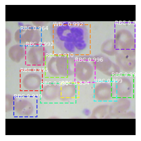
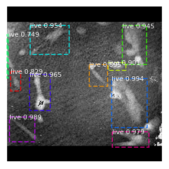

# Faster RCNN on TF2
This repo modify [matterport/Mask_RCNN](https://github.com/matterport/Mask_RCNN) for implementation of Faster RCNN model  

## Architecture
  

## setup
* Anaconda on Windows 10  
* Python 3.6.6  
* Use Spyder IDE edit my code  
* GTX 1060 (Laptop)
* CUDA 10.1 + cudnn v8.0.4.30  
* RAM: 16GB  
The code can run on tf2.3  

## Work list 
- [x] Remove mask part  
- [x] Input Shapes dataset  
- [x] Input BCCD dataset  
- [x] Input VOC 2007 data  
- [x] Input Custom data  
- [x] Input multi voc format dataset  
- [x] Input COCO data  
- [x] Change backbone (use Keras application)  
- [x] Head layer reduce weights  
- [x] Inspect training results (model output and weights)
- [ ] Training results
- [ ] Data augmentation

## Tips   
* Install package can follow [here](https://github.com/jacky10001/Faster_RCNN-tf2/blob/main/requirements.txt)   
* Input data  
  * Modify config  
    **IMAGE_RESIZE_MODE = "none" or "square"**  
    "square" can handle different size image  
    
    **NUM_CLASSES**  
    Set number of classes of custom dataset  
  * Use VOC annotation format (.xml)

## Results  
Shapes dataset  
mAP: 0.95 (100 samples)  
  

VOC dataset  
mAP: 0.49 (4952 samples)  
  

BCCD dataset  
mAP: 0.74 (72 samples)  
  

Custom dataset (Digital Holographic Microscopy)  
  

## Refer
Paper: [here](https://arxiv.org/abs/1506.01497)  
PSACAL VOC 2007 dataset: [here](http://host.robots.ox.ac.uk/pascal/VOC/voc2007/index.html)  
BCCD dataset: [here](https://github.com/Shenggan/BCCD_Dataset)  
Hand dataset on my [repo](https://github.com/jacky10001/handdata_mat2voc)  
Related work on my [repo](https://github.com/jacky10001/Mask_RCNN-tf2)  
